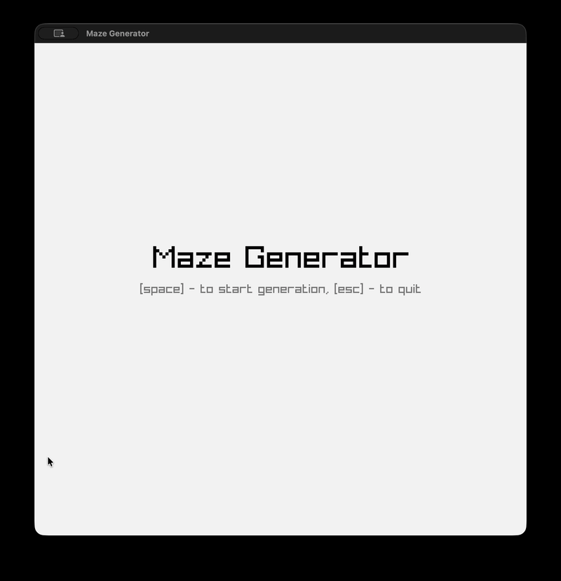

# Maze Generator & Solver in Zig & Raylib

A real-time maze generator, visualizer, and interactive puzzle solver built in **Zig** and **Raylib**, implementing the Randomized Depth-First Search (DFS) algorithm.



## Features

- **Application State Machine**:
  - **Home**: Title screen welcoming the user with prompt controls.
  - **Generate**: Real-time visualization of the Randomized Depth-First Search (DFS) carving the maze.
  - **Play**: Interactive mode where you navigate through the generated maze using arrow keys from start to destination.
- **Raylib Integration**: Smooth graphics rendering utilizing Raylib bindings for Zig.
- **Configurable Grid**: Easily adjust maze dimensions, cell sizes, and frame rates via `src/maze_config.zig`.

## Project Structure

- `src/main.zig`: Application state machine (`Home`, `Generate`, `Play`), UI text rendering, and user input handling.
- `src/maze.zig`: Core maze structures (`pathBlock`), DFS generator (`randDfs`), and player traversal logic (`play`).
- `src/maze_config.zig`: Configuration parameters for screen resolution, grid size, starting offsets, and animation speed (`fps = 45`).

## Controls

| State | Key | Action |
| --- | --- | --- |
| **Home** | `SPACE` | Start maze generation |
| **Home** | `ESC` | Quit application |
| **Generate** | `R` | Restart new generation |
| **Generate** | `Q` | Return to Home screen |
| **Play** | `Arrow Keys` | Navigate through the maze |
| **Play** | `R` | Restart new generation |
| **Play** | `Q` | Return to Home screen |

## Prerequisites

- [Zig](https://ziglang.org/) (version 0.13+ or compatible)
- [Raylib](https://www.raylib.com/) (managed automatically via Zig package manager)

## Getting Started

1. Clone the repository and navigate into the project directory:
   ```bash
   cd maze_generator
   ```

2. Build and run the project:
   ```bash
   zig build run
   ```
